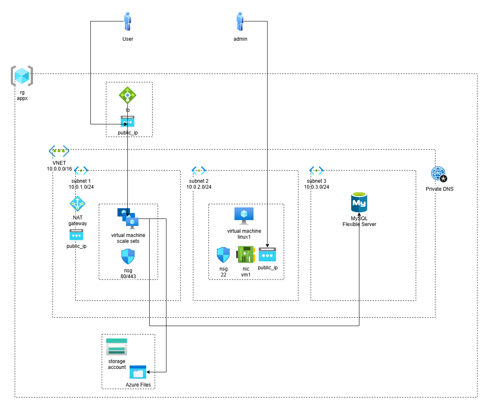

# Projeto simples Azure + Terraform

Este projeto cria uma infraestrutura no Azure contendo:
- VNET
- Subnets
- NAT Gateway
- IP público
- VMSS (Virtual Machine Scale Set) Linux com Nginx
- VM Linux
- Load Balancer
- Storage Account com Share
- Banco de dados MySQL




## Começar

```
az login
```

```
export ARM_SUBSCRIPTION_ID=suaSubscription
```

```
tofu init
tofu validate
tofu apply
```


### Comandos
Visualizar Imagens disponíveis para VMs.
```
az vm image list --output table
```
Listar SKUs disponíveis para MySQL Flexible.
```
az mysql flexible-server list-skus --out table --location eastus2
```
