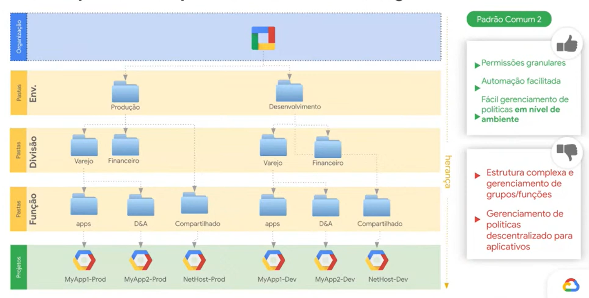

# GCP

<https://www.udemy.com/course/certificacao-google-cloud-associate/learn/lecture/25653690#overview>

<https://docs.cloud.google.com/docs?hl=pt-br>

## Regiões

<https://cloud.google.com/about/locations?hl=pt-br>

Brazil - southamerica-east1 
Iowa (Principal) - us-central1

## Calculadora

<https://cloud.google.com/products/calculator?hl=pt-BR>

Tipos de cobrança
- On-demand
- Preemptible (spot)
- Contrato 1 ano
- Contrato 3 anos

## Well-Architected Framework

<https://docs.cloud.google.com/docs/get-started/well-architected-framework?hl=pt-br>

<https://docs.cloud.google.com/architecture/framework?hl=pt-br>

As recomendações do Well-Architected Framework são organizadas nos seguintes pilares:

- **Excelência operacional**: implemente, opere, monitore e gerencie com eficiência suas cargas de trabalho na nuvem.
- **Segurança**: maximize a segurança dos dados e cargas de trabalho na nuvem, projete para privacidade e alinhe com os padrões e requisitos regulamentares.
- **Confiabilidade**: projete e opere cargas de trabalho resilientes e altamente disponíveis na nuvem.
- **Otimização de custos**: maximize o valor comercial do seu investimento em Google Cloud.
- **Otimização de desempenho**: projete e ajuste os recursos da nuvem para um desempenho ideal.

## CLI (gcloud)

<https://docs.cloud.google.com/sdk/docs/install-sdk?hl=pt-br>

<https://docs.cloud.google.com/sdk/docs/cheatsheet?hl=pt-br>


## Gestáo de Recursos



- **Organização** seria a raiz. Considere o tenant.
- **Pastas** ajudam a organizar e separar ambientes/ permissões. Considere subscriptions ou Management Groups.
- **Projetos** é onde o recurso pode ser criado. Considere Grupo de Recursos.
- **Recurso** é o recurso em si. VM, Storage, etc.

Nomenclatura consistente:

`prj-gcb-prd-net-landing-0`

1. Tipo de recurso
2. Prefixo da empresa/organização
3. ambiente
4. equipe/ unidade negócio
5. nome descritivo
6. ID progressivo

## Organizations

Para usar/criar uma organização é necessário ter um Domínio válido.
Não aceita @gmail.com.

Para criar Pastas (folders) dentro da Organização, é necessário dar a permissão de Folder Creator ou Folder Admin, caso contrário não funciona, mesmo sendo Organization Admin.

## IAM

<https://docs.cloud.google.com/iam/docs/overview?hl=pt-br>

Não há criação de usuários no GCP. 
Os usuários devem vir do Workspace ou do Google Identify. 
Você associa os usuários as permissões.

Você pode adicionar usuários de outros domínios ou até gmail, porém precisa mudar as politicas da organização para isto.

O usuário principal não tem todas as permissões na Organização.
Deve-se ir adicionando conforme necessidade.

## Cloud Storage

<https://docs.cloud.google.com/storage/docs/introduction?hl=pt-br>

Armazenamento de Objetos.

Tamanho máximo arquivo: 5TB

### Classes de armazenamento

<https://docs.cloud.google.com/storage/docs/storage-classes?hl=pt-br>

- Standard 
- Nearline
- Coldline
- Archive


## Compute Engine

<https://docs.cloud.google.com/docs/compute-area?hl=pt-br>

Permite definir CPU e Memória sem ser um SKU especifico.

A cobrança dos recursos é feita inicialmente por 1 minuto e depois por cada segundo de uso.

É possível trocar o tipo de Virtual Machine, após fazer um Stop da VM.

### Tipos de VMs

<https://docs.cloud.google.com/compute/docs/machine-resource?hl=pt-br>

- General purpose
    - N1, N2, N4
    - C3, C4
    - E2
    - T2
- Compute optimized
    - C2
    - H3, H4
- Memory optimized
    - M1, M2, M3, M4
    - X4
- Storage optimized
    - Z3


### Instance Templates

Template de Vm para criação de Instance Group

### Instance Group

Grupo de VMs para AutoScaling

### Health Checks

Checagem de saúde das Instâncias

## VPC

<https://docs.cloud.google.com/vpc/docs/vpc?hl=pt-br>

Existe uma VPC padrão (default) com uma subrede em cada região do GCP.

Você pode ter subnets de várias regiões em uma mesma VPC.

### Script para instalar o Nginx em uma instância derivada do Debian

Colocar na parte de Advanced Configuration, Automation.
```
#!/bin/bash
sudo apt update && sudo apt install nginx -y
sudo systemctl enable nginx && systemctl start nginx
```
