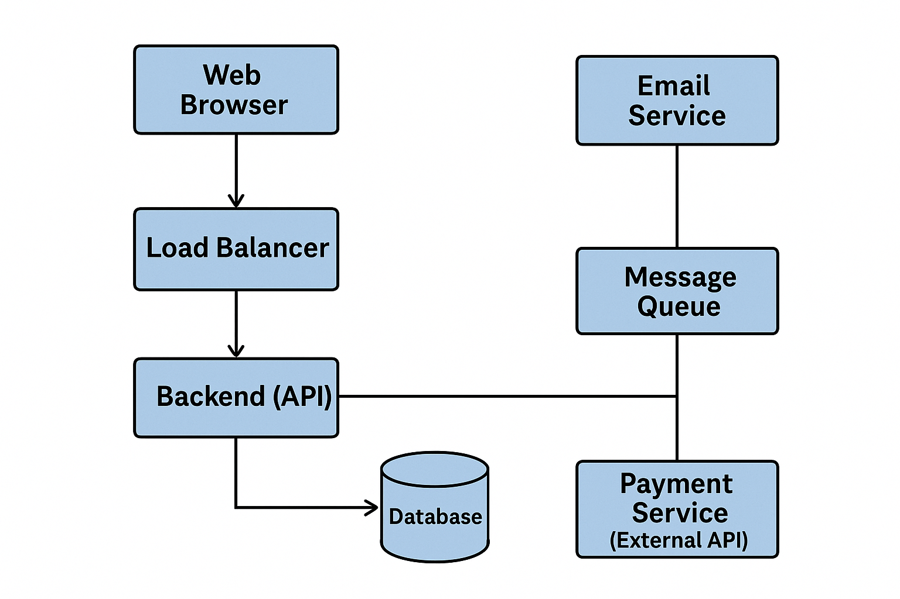

# System Design

System Design é o processo de definir a arquitetura, componentes, módulos, interfaces e dados de um sistema com base em requisitos funcionais e não-funcionais.

Resumidamente:\
É o "projeto arquitetônico" de como o seu sistema vai funcionar, escalar, ser seguro e manter a performance ao crescer.

## Por que é importante?
- Garante escalabilidade
- Suporta alta disponibilidade
- Evita gargalos e falhas
- Deixa o sistema modular e manutenível
- Permite decisões técnicas coerentes com os objetivos do negócio

## Entendimento do Problema
- O que o sistema precisa fazer? (requisitos funcionais)
- Quantos usuários vão usar? Crescerá rápido? (escalabilidade)
- Quais SLAs são esperados? (ex: 99.9% de disponibilidade)
- Tem requisitos de segurança, latência, compliance?

*Criar uma plataforma Web onde clientes possam fazer pedidos de produtos, e a empresa receba e processe esses pedidos.*

## Requisitos funcionais

- Login de usuário
- Listar produtos
- Adicionar ao carrinho
- Realizar pedido
- Acompanhar pedido

## Requisitos Não funcionais

- Escalável
- Disponível
- Seguro
- Observável

## Componentes do Sistema

| Componente | Função |
|---|---|
| Web Browser | Interface do usuário (frontend) |
| Load Balancer | Distribui requisições entre instâncias do backend |
| Backend | Contém a lógica da aplicação (Node, Python, Java, etc) |
| Database | Armazena os dados (produtos, pedidos, etc) |
| Cache (Redis) | Melhora a performance de dados acessados frequentemente |
| File (Queue) | Processamento assincrono (ex: envio de email) |
| Serviços externos | API de Pagamento |

## Arquitetura técnica

### Frontend (React, Angular, Vue)
- Roda no navegador, consome APIs

### API Gateway ou Load Balancer (Nginx, AWS ELB)
- Recebe as requisições e direciona para os serviços

### Backend (REST ou GraphQL)
- Pode ser monolítico ou baseado em microsserviços

### Banco de Dados
- PostgreSQL ou MySQL para dados estruturados
- MongoDB se quiser mais flexibilidade

### Cache (Redis ou Memcached)
- Para listas de produtos, dados de sessão

### Fila (RabbitMQ, Kafka, SQS)
- Para enviar e-mails, processar pagamentos

### Serviços de apoio
- Envio de e-mail (SendGrid, SES)
- Pagamento (Stripe, MercadoPago)

## Segurança
- HTTPS
- JWT para autenticação
- Rate limiting
- Firewall (WAF)
- Criptografia de dados
