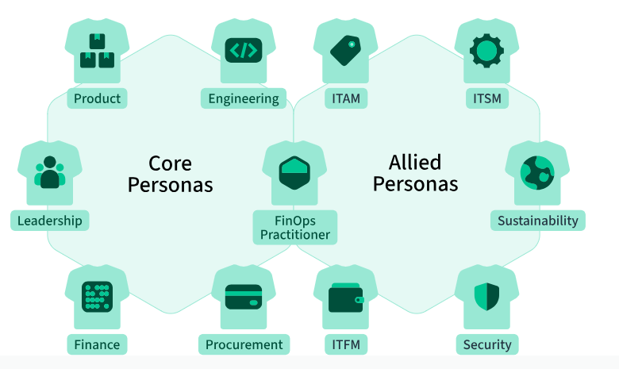
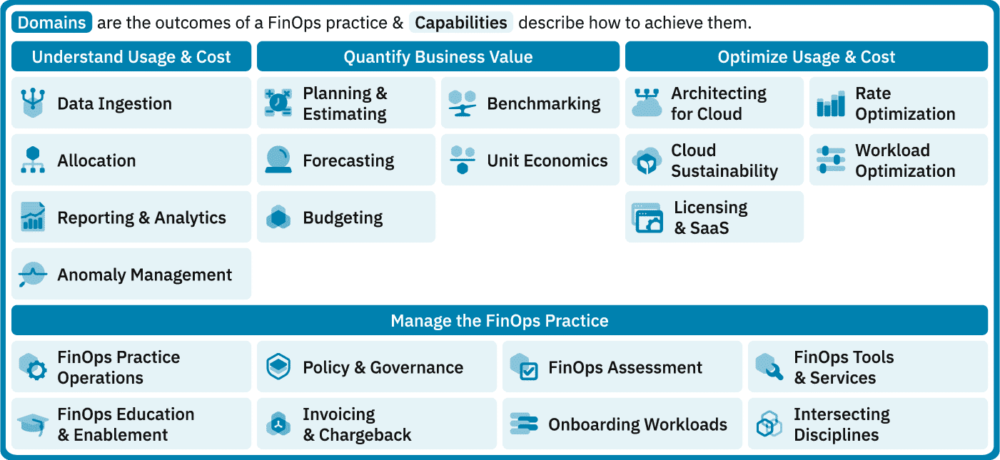
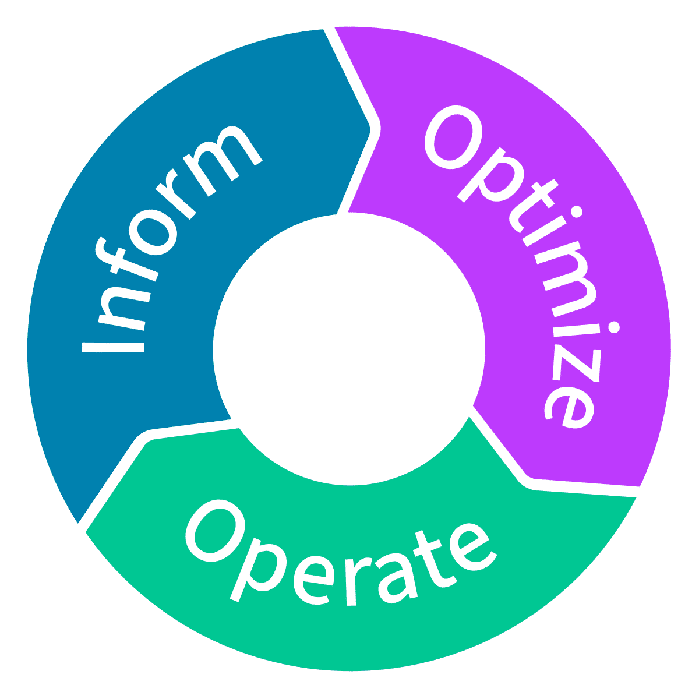

# FinOps

## Ref: 
<https://www.finops.org/>\
<https://www.finops.org/training-certification/>\
<https://www.finops.org/framework/>\
<https://www.youtube.com/watch?v=ZTUjPIGAxwU>

## O que é

FinOps é um modelo operacional (framework) e uma prática cultural para maximizar o valor dos gastos com nuvem e tecnologia.

- **Pessoas** - Os grupos de partes interessadas que trabalham em conjunto para realizar atividades de FinOps.
- **Capacidades** - As atividades que você realizará para alcançar os resultados desejados de FinOps.
- **Dominios** - Descrever os resultados de negócios fundamentais que as organizações devem alcançar ao implementar FinOps

## Principios
<https://www.finops.org/framework/principles/>

### Equipes precisam colaborar 

- Equipes trablham juntas para promover melhorias continuas em termos de eficiência e inovação.

### O Valor comercial impulsiona as decisões tecnológicas

- Métricas unitárias, econômicas e baseadas em valor demonstram o impacto nos negócios melhor do que o gasto agregado.
- Faça escolhas conscientes, ponderando o equilibrio entre custo, qualidade e velocidade.
- Considere a nuvem como um motor de inovação.
- Considere os Escopos de FinOps como um fator de geração de valor para os negócios.

### Cada um assume a responsabilidade pelo uso da tecnologia

- A responsabilidade pelo uso e pelos custos é levada ao extremo, com os engenheiros assumindo a responsabilidade pelos custos desde o projeto arquitetonico até as operações continuas.
- As equipes individuais de desenvolvimento de funcionalidades e produtos têm autonomia para gerenciar seu próprio uso da nuvem e de tecnologias interligadas, de acordo com seu orçamento.
- Descentralizar a tomada de decisões em torno de arquitetura com boa relação custo-beneficio, uso de recursos e otimização.
- As equipes devem começar a considerar o custo como uma nova métrica de eficiência desde o inicio do ciclo de vida do desenvolvimento de software.

### Os dados de FinOps devem ser acessíveis, oportunos e precisos

- Processar e compartilhar dados de custos assim que estiverem disponíveis.
- A visibilidade em tempo real impulsiona, de forma autônoma, uma melhor utilização da nuvem e da tecnologia.
- Ciclos de feedback rápidos resultam em comportamentos mais eficiêntes.
- É fornecida visibilidade consistente dos gastos com nuvem e tecnologia a todos os níveis da organização.
- Criar, monitorar e aprimorar previsões e planejamentos financeiros em tempo real.
- A análise de tendências e variações ajuda a explicar por que os custos aumentaram.
- A avaliação comparativa interna da equipe impulsiona as melhores práticas e celebra as conquistas.
- A análise comparativa com empresas do mesmo setor avalia o desempenho da sua empresa.

### As operações de financeiras (FinOps) devem ser habilitadas de forma centralizada

- A equipe central incentiva, promove e viabiliza as melhores práticas em um modelo de responsabilidade compartilhada, semelhante ao da segurança, que possui uma equipe central, mas todos permanecem responsáveis por sua parcela de uso da tecnologia.
- É necessário o apoio da alta administração ao FinOps, suas práticas e processos.
- A otimização de tarifas, compromissos e descontos é centralizada para aproveitar as economias de escalas.
- Eliminar a necessidade de engenheiros e equipes de operações se preocuparem com negociações de tarifas, permitindo que eles se concentrem na otimização do uso de seus próprios ambientes.

### Aproveite o modelo de custo variável de nuvem.

- O modelo de custo variável da nuvem deve ser visto como uma oportunidade para agregar mais valor, e não como um risco.
- Adote a previsão, o planejamento e a aquisição de capacidade no momento certo.
- O planejamento ágil e iterativo é preferivel aos planos estáticos de longo prazo.
- Adote uma abordagem proativa no design de sistemas, com ajustes continuos na otimização de nuvem, em vez de correções reativas esporádicas.

## Personas

<https://www.finops.org/framework/personas/>

### Core Personas (principais)
- Product
- Engineering
- Leadership
- Finance
- Procurement
- FinOps Practitioner

### Allied Personas (aliados)
- ITAM
- ITSM
- Sustainability
- Security
- ITFM
- FinOps Practitioner

## Domínios FinOps

<https://www.finops.org/framework/domains/>

1. Entenda o uso e o custo
2. Quantificar o valor do negócio
3. Otimize o uso e os custos
4. Gerenciar a prática de FinOps

## Fases

<https://www.finops.org/framework/phases/>

### Informar

Na fase de informação, as atividades de FinOps envolvem a identificação de fontes de dados para custos, uso e eficiência da nuvem e tecnologia. O uso desses dados para alocação, análise e geração de relatórios capacida as equipes a desenvolver habilidades em orçamento, previsão e tendências, criação de KPIs para benchmarking e desenvolvimento de métricas que revelem o valor comercial dos gastos com nuvem e tecnologia da organização.

### Otimizar

Na fase de Otimização, as atividades de FinOps envolvem a identificação de oportunidades para melhorar a eficiência da nuvem e da tecnologia, utilizando os dados e as capacidades desenvolvidas na fase de informação.

Esta fase também envolve a colaboração entre equipes para otimizar a visibilidade, os relatórios e os processos de gestão, em áreas onde as métricas unitárias indicam que o desempenho não está alinhado aos objetivos de valor da organização.

### Operar

Na fase de Operação, as atividades de FinOps envolvem a implementação de mudanças organizacionais para operacionalizar as operações financeiras, utilizando os dados e as capacidades desenvolvidas nas fases de informação e Otimização. Isso inclui o estabelecimento de politicas de governança o monitoramento da conformidade e o empoderamento dos individuos por meio do desenvolvimento de programas de treinamento, diretrizes de equipe e políticas de automação alinhadas aos objetivos organizacionais.

Ao longo dessa fase, tenha em mente o objetivo de desenvolver estratégias e aprimorar fluxos de trabalho de forma iterativa; isso envolve revisitar as fases de informação e Otimização para amadurecer as atividades adotadas das Capacidades da Estrutura, avaliar a introdução de novas Capacidades e evoluir as operações de FinOps para a organização.

## Maturidade

### Engatinhar
- Poucos relatórios e ferramentas
- KPIs básicos definidos para a medição do sucesso.
- Processos simples são definidos para lidar com a capacidade.
- Não lida ou identifica casos extremos.
- Planos:
    - Economias de 60% adquirido através de reservas.
    - Alocação de mais de 50% dos recursos.
    - Previsibilidade com 20% de margem de erro.

### Andar
- Capacidade é entendida e visível dentro da organização.
- KPIs médios / altos são definidos para medir sucesso.
- Processos e automações cobrem a maior parte dos requisitos de capacidade.
- Casos extremos são identificados e o esforço para endereçar é estimado.
- Planos:
    - Economias de 70% adquirido atráves de reservas.
    - Alocação de mais de 80% dos recursos.
    - Previsibilidade com 15% de margem de erro.

### Correr
- Capacidade é entendida e visível por todos os times da organização.
- KPIs muito altos são definidos para medir sucesso.
- Automação é a abordagem preferencial.
- Casos extremos são endereçados.
- Planos:
    - Economias de mais de 80% adquirido através de reservas.
    - Alocação de mais de 90% dos recursos.
    - Previsibilidade com 12% de margem de erro.

____

 

# Pratica

## Planejamento
- Identificação dos Stakeholders e Principais Desafios, Assessment.
- Criação de um plano
- União de apoiadores da estratégia.
- Recrutamento de apoiadores.

## Preparação
- FinOps Readiness
    - Taxonomia de Tags
        - Aplicação
        - Ambiente
        - Centro de Custo
        - Owner
    - Entendimento dos KPIs
    - Definição de thresholds de alertas
    - Dashboards por Persona
    - Preparação do Modelo de Previsibilidade
- Engajamento de Stakeholders
    - Compromisso de expectativas em relação aos objetivos
    - Busca por lidenranças dentro das equipes
    - Inicio de Cadências
    - Quick-Wins
        - Modelo de contratação de serviços
            - Reservas e Saving Plans
            - Spot 
            - On-demand
        - Dimensionamento de Serviços
        - Contratos

## Inicio
- Estratégia de Comunicação e Eduração
- Workflows
    - Alertas de Anomalias
    - Alertas de Budgets
    - Cadência de Recomendações de Otimização
    - Política de Governança de Custos
- Templates de Mensuração
- Playbooks (Processos)
    - Entendimento da utilização e custo da nuvem
    - Acompanhamento de performance e benchmark
    - Decisão em tempo real
    - Otimização do consumo
