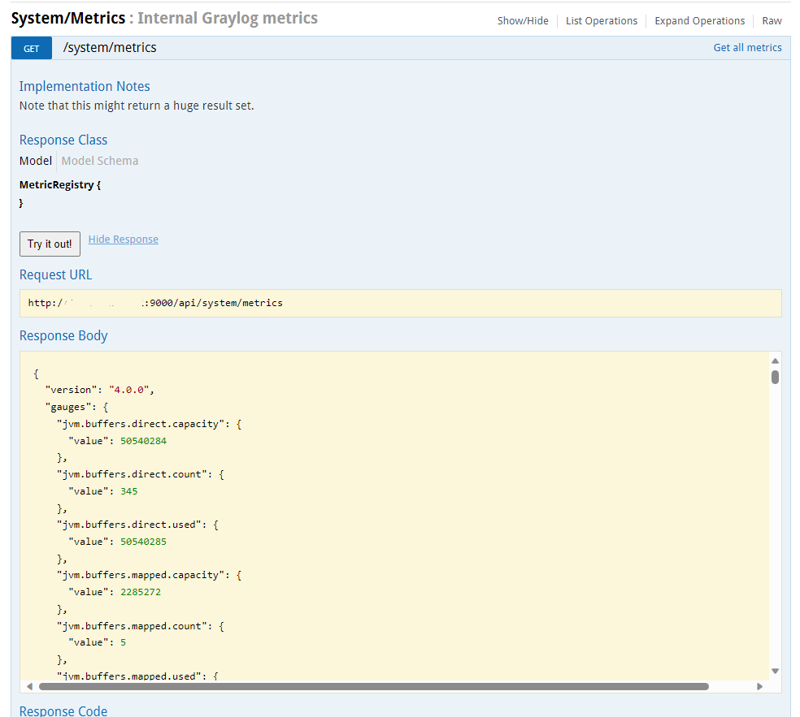

# API Graylog
O graylog tem uma API para consultar métricas de uso, entre outros.

A documentação para acesso a API:\
<https://go2docs.graylog.org/5-0/setting_up_graylog/rest_api.html>

Consultar os itens da API:\
<http://ipdograylog/api/api-browser>

Basicamente, pode-se navegar na página da API, escolher um Item como exemplo System/Metrics e clicar em "Show/Hide".
Será exibido opções disponíveis.


Escolhendo uma, e clicando no botão "Try it out" será exibido os dados.



Outro exemplo:\
Escolhendo System/metrics/{metricName}\
Esta tem um valor obrigatório que é o nome da métrica, consultado no exemplo anterior.


# API OpenSearch


Mostra as opções disponíveis para visualização de indices, para aplicar filtros, e mostrar colunas.
```
https://OPENSEARCH:9200/_cat/indices?help
```

Mostra os indices criados no padrão do Opensearch:
```
https://OPENSEARCH:9200/_cat/indices?v
```

Mostra os indices criados com as colunas (indice, tamanho, data criação):
```
https://OPENSEARCH:9200/_cat/indices?h=i,ss,cds&s=cds
```

Consulta os indices via curl:
```
curl --request GET -u admin --url 
https://OPENSEARCH:9200/_cat/indices?v