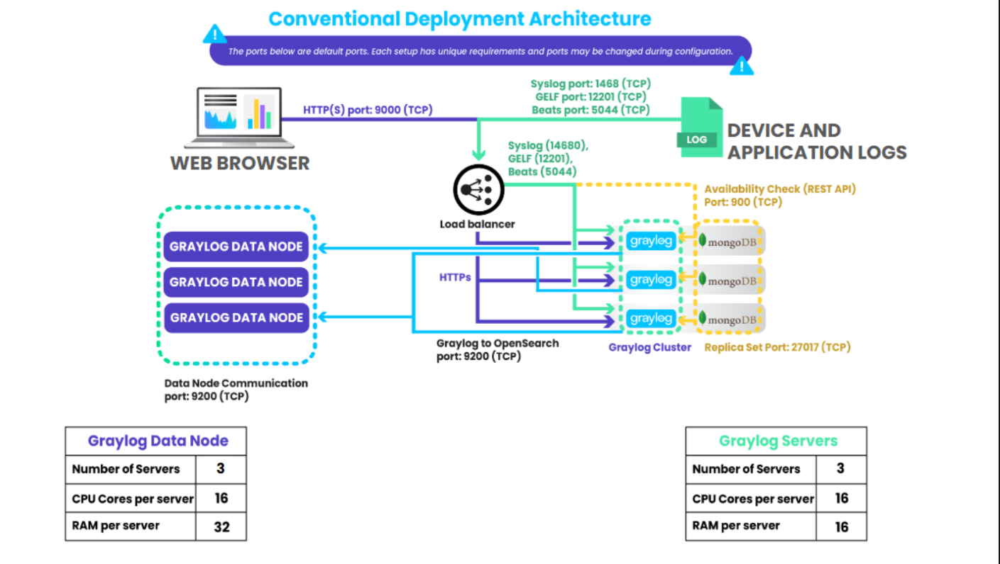

# Graylog

Armazene e centralize logs de Servidores, Firewalls, Containers, etc.

## Documentação 
<https://go2docs.graylog.org/current/home.htm>



## Fluxo

| Inputs | Streams | Pipelines | Indices |
|-|-|-|-|
| Syslog | Default | No match | Default |
| Syslog | Linux | No match | Linux |
| Filebeat | Windows | No match | Windows | 

### Inputs

Os dados de logs são recebidos criando Inputs. Existem alguns tipos de inputs.
- Syslog
- Beats
- Gelf
- Entre outros

### Indices

Os indices são uma maneira de otimizar as operações de pesquisa e armazenamento (retenção) dos logs.

### Streams

Os Streams são uma maneira de roteamento, ou seja, definição de regras para os dados de Logs serem armazenados.\
Normalmente utilizado para encaminhar os logs para um conjunto de indices com base em filtros (regras).

### Pipelines

Os pipelines são uma parte essencial do processamento de mensagens de log no Graylog, formando a espinha dorsal que une todas as etapas de processamento aplicadas aos seus dados. Eles servem como uma estrutura estruturada que permite definir como os dados de log de entrada são avaliados, modificados e roteados por meio de várias etapas de processamento.

Um uso comum, poderia ser de remover colunas (fields) de uma mensagem de log.

## Componentes

### Servidor
- Mongodb
- Graylog-Server
- Opensearch

### Clientes
#### Linux
- Syslog / Rsyslog
- Journalbeat
#### Windows
- Winlogbeat
#### Docker
- Gelf

## Instalação Server

### Standalone

<https://go2docs.graylog.org/current/downloading_and_installing_graylog/red_hat_installation_os.htm>

#### Mongodb

- Criar repositorio
- Instalar mongo-org
- Habilitar e Iniciar mongo-org
- Desativar updates mongo-org

#### Opensearch

- Criar repositorio
- Criar senha admin
- Instalar Opensearch
- Configurar Opensearch

Example:
```
cluster.name: graylog
node.name: SERVIDOR
discovery.type: single-node
network.host: 0.0.0.0
action.auto_create_index: false
plugins.security.disabled: true
indices.query.bool.max_clause_count: 32768
```
- Configurar Mem Java.
- Configurar parametros Kernel
- Habilitar e Iniciar Opensearch
- Desativar updates Opensearch

#### Graylogserver

- Adicionar repositorio
- Instalar Graylog-server
- Criar password_secret
- Criar root_password_sha2
- Configurar passwords
- Configurar Listen Graylog-server
- Configurar Conexão Opensearch
- Habilitar e Iniciar Graylog-server
- Desativar updates Graylog-server

### Multinode

<https://go2docs.graylog.org/current/setting_up_graylog/multi-node_setup.html>

#### Mongodb

<https://www.mongodb.com/pt-br/docs/manual/tutorial/deploy-replica-set/>

#### Opensearch

<https://opensearch.org/docs/latest/install-and-configure/install-opensearch/index/>

<https://opensearch.org/docs/latest/tuning-your-cluster/>

SSL:
<https://opensearch.org/docs/latest/security/configuration/generate-certificates/>

#### Graylog

<https://go2docs.graylog.org/current/downloading_and_installing_graylog/red_hat_installation.htm>

<https://go2docs.graylog.org/current/setting_up_graylog/multi-node_setup.html>


#### SSL

<https://go2docs.graylog.org/current/setting_up_graylog/https.html>

Se utilizar o SSL, é necessário importar a rootCA no Java keystore.

## Instalação Clientes

### Windows

<https://www.elastic.co/fr/downloads/beats/winlogbeat>\
<https://www.elastic.co/guide/en/beats/winlogbeat/current/winlogbeat-installation-configuration.html>

Example:
```
winlogbeat.event_logs
  - name: Security
    ignore_older: 72h
    event_id: 4624, 4625, 4626, 4627, 4634, 4648, 4656, 4663, 4670, 4688

output.logstash:
  hosts: ["GRAYLOG-SERVER:5045"]
```

### Linux

Rsyslog Example:
```
*.* @GRAYLOG-SERVER:1514;RSYSLOG_SyslogProtocol23Format
```

### Docker

Gelf Example:
```
{
  "log-driver": "gelf",
  "log-opts": {
          "gelf-address": "udp://GRAYLOG-SERVER:12201"
  }
}
```

## API

**Curl**:
```
curl --request GET -u admin --url http://opensearchServer:9200/<api-address>?pretty
```
```
curl --request PUT/POST -u admin \
    --url http://opensearchServer:9200/<api-address> \
     --header 'Content-Type: application/json' \
     --data '{configdata}'

```

[Utilizando API do Graylog e Opensearch](API.md)

## Zabbix

[Monitorando Filas do Graylog com Zabbix](Zabbix.md)


## Snapshots (Opensearch)

O Graylog Free só trabalha com uma opção de retenção. Excluir.\
Porém, se mantiver os logs por muito tempo no armazenamento quente, o Opensearch perderá performance.\
Como solução alternativa, é possível criar Snapshots do Opensearch em um outro armazenamento (frio).

<https://opensearch.org/docs/latest/tuning-your-cluster/availability-and-recovery/snapshots/snapshot-restore/>

<https://opensearch.org/docs/latest/tuning-your-cluster/availability-and-recovery/snapshots/snapshot-management/>

<https://opensearch.org/docs/latest/tuning-your-cluster/availability-and-recovery/snapshots/sm-api/>

### Configuração 
- Registre um repositório:
- Crie uma Politica de Snapshot 
- Consulte as politicas

### Restore

Antes de executar um restore de indice, é necessário alterar a retenção do Index na configuração dele no Graylog.\
Exemplo:\
Se a configuração for para manter 3 indices, altere para 5 ou 6 para conseguir restaurar um Snapshot. Depois poderá voltar a configuração original.

- Consulte os Snapshots
```
curl --request GET -u admin --url https://opensearch:9200/_snapshot/REPO/_all?pretty
```

- Restaure um Snapshot
```
curl --request POST -u admin \
     --url https://opensearch:9200/_snapshot/REPO/SNAPSHOTNAME/_restore \
     --header 'Content-Type: application/json' \
     --data '{
      "indices": "INDICENAME"
     }'
```
- Recalcule o IndexSet\
Para se tornar acessível é necessário executar o "Recalcule Index ranges" do Grupo de Index que foi restaurado.