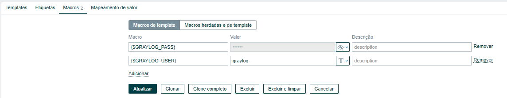
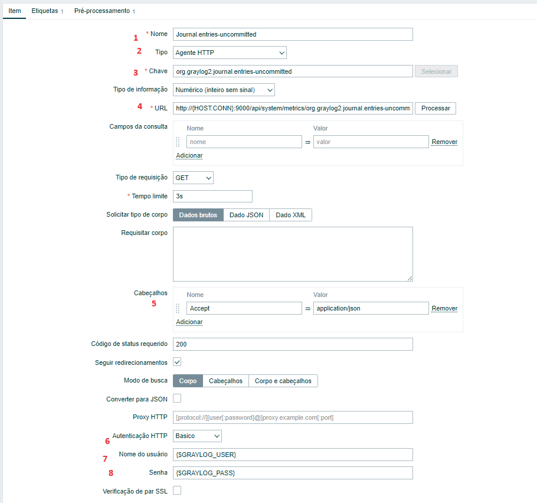

# Zabbix

Para monitorar alguns itens da API no Zabbix, foi criado um Template chamado "Graylog".\
Será necessário criar um usuário no Graylog para consulta na API.

Neste template, foi criado macros para usuário e senha de acesso a API.

Foi criado também itens do tipo "Agent HTTP".

Basicamente todos os itens são quase iguais.\
Os campos que mudam são:
- Nome
- Chave
- URL

A URL é composta do seguinte:\
**<http://{HOST.CONN}:9000/api/system/metrics/org.graylog2.journal.entries-uncommitted\>\
Endereço do Graylog / Caminho das Métricas / Nome da Métrica.**

Para trazer somente o valor e não o resultado em JSON, é necessário criar um "Pré-processamento".

As métricas que foram utilizadas foram:

- org.graylog2.journal.entries-uncommitted
- org.graylog2.buffers.input.usage
- org.graylog2.buffers.input.size
- org.graylog2.buffers.process.usage
- org.graylog2.buffers.process.size
- org.graylog2.buffers.output.usage
- org.graylog2.buffers.output.size

Também foi criado itens calculados para determinar o percentual de uso das Filas.\
(item.uso/item.size)*100

Um exemplo:\
**(last(//org.graylog2.buffers.process.usage)/
last(//org.graylog2.buffers.process.size))X100**

Depois é só associar os HOST ao Template e começar visualizar as métricas.\
Pode-se criar um Dashboard para ter uma visualização mais ampla.

