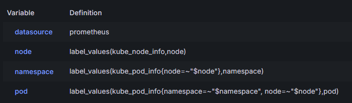
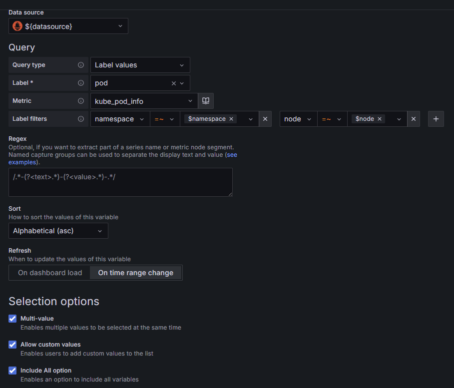

# Grafana

## Dashboards

### Variáveis

#### Prometheus 

#### Zabbix

| chave/item | valor |
|---|---|
| Query type | Host |
| Group | Firewall |
| Host | /4351_PA.*/ |
| Regex | /.*/ |

### Tabelas

- Criar as variáveis
- Criar quantas querys forem necessárias.
- Criar transformações
    - 1 - Merge series/tables
    - 2 - Organize fields by name