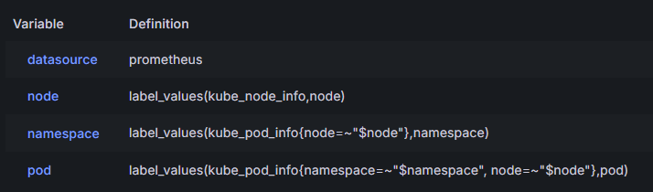
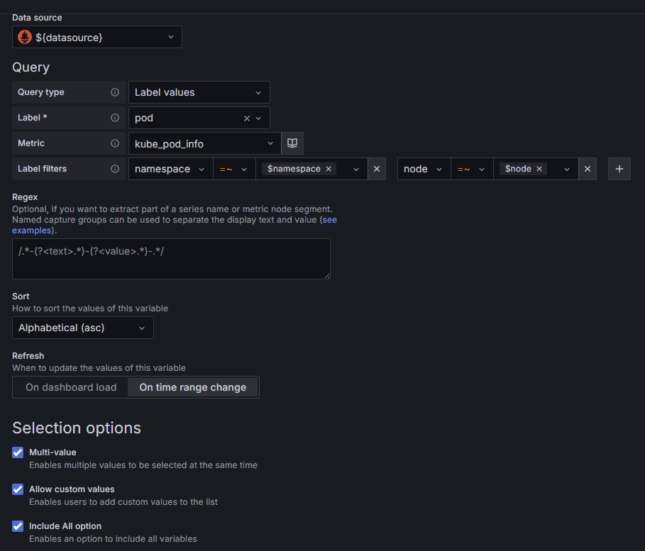

# Grafana

## Dashboards

### Variáveis

#### Prometheus 



#### Zabbix

| chave/item | valor |
|---|---|
| Query type | Host |
| Group | Firewall |
| Host | /1234_00.*/ |
| Regex | /.*/ |

### Tabelas

- Criar as variáveis
- Criar quantas querys forem necessárias.
- Criar transformações
    - 1 - Labels to fields (não em todos casos)
    - 2 - Merge series/tables
    - 3 - Organize fields by name
    - 4 - Group by
          - Host/Name Group by
          - Itens: calculate last* 


## Grafana Avançado

### Cores gerais
Alterar cores gerais do Grafana comm HTML Graphics. Utiliza CSS + HTML.

Necessário instalar o plugin HTML Graphics.

Ref: <https://www.youtube.com/watch?v=x0L5birW2eA>

### Personalização de Paineis com HTML + CSS + Javascript

Ref: <https://www.youtube.com/watch?v=ld5BfMEZwfg>\
<https://www.youtube.com/watch?v=zfW6QIA-SqI>

### Tabela Dinamica Zabbix 
Tabela longa para Tabela Larga ou Pivot Table.

Ref: <https://www.youtube.com/watch?v=u0W--hR5S6c>

Considere 1 host do Zabbix, e Itens semelhantes como:
- Disco C Total Space
- Disco D Total Space
- Disco C Used Space
- Disco D Used Space

Como mostrar em uma Tabela:
| Disco | Total Space |  Used Space |
|- | - | - |
| C: | 100GB | 50% |
| D: | 200GB | 78% |

#### Crie uma visualização do tipo Table.

- Vincule o Host e Itens (Queries). 1 query para cada Item (Total / Used).
- Crie transformações:
- - Reduce
- - Extract Fields (Cria novos itens com base no atual)
```
    Source: Field
	Format: RegExp
	RegExp: /(?<Particao>.*\))(?<Item>.*)/
		/(?<Tipo>.*)\s+-(?<App>.*)/
	
		(?<Tipo>.*) - Captura tudo até encontrar o próximo trecho da regex
		\s	- Qualquer espaço em branco
		+ 	- um ou mais
		-	- O próprio hífen
		(?<App>.*)	- Captura todo o resto
```	
	
- - Grouping to matrix
```
	Column:  Item
	Row: Partição
	Value: Last
```  
