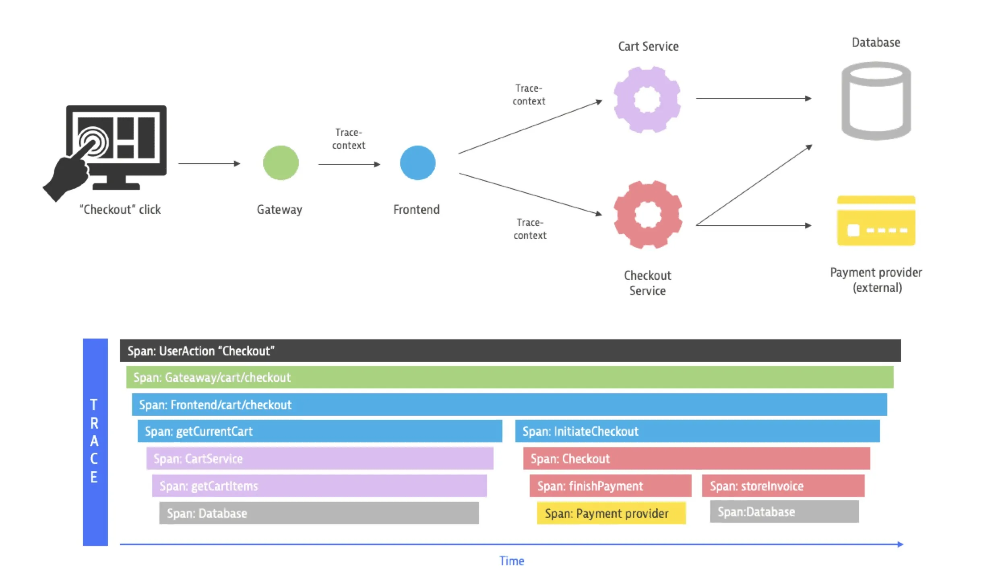

# Tracing


Tracing, de forma resumida, é uma técnica usada para rastrear o caminho de uma requisição (como uma chamada HTTP ou uma transação) enquanto ela passa por diferentes serviços ou componentes de um sistema distribuído.

O objetivo do tracing é fornecer visibilidade de ponta a ponta, permitindo:

- Identificar gargalos de performance;
- Entender a sequência de eventos em uma requisição;
- Diagnosticar erros em sistemas complexos;
- Correlacionar logs e métricas com uma requisição específica (através de IDs de trace e span).



Um tracing é formado por:

- Trace
    - Span
        - Tags
        - Logs
    - SpanContext
        - TraceID
        - SpanID

## Ferramentas Populares

- OpenTelemetry
- Jaeger
- Zipkin
- Datadog
- APM
- New Relig

## Como aplicar

Utilize o OpenTelemetry:
<https://opentelemetry.io/docs/getting-started/>

Aplicar tracing automaticamente em Flask com OpenTelemetry.

<https://github.com/julianorib/mysite>\
Este projeto é um exemplo de aplicação que expoe traces.\
Estas podem ser visualizadas no Jaeger que sobe junto.

### Instalar o OpenTelemetry

```
pip install opentelemetry-distro opentelemetry-instrumentation-flask opentelemetry-exporter-otlp

```

### Instrumente a aplicação 
```
OTEL_SERVICE_NAME=mysite \
OTEL_LOG_LEVEL=debug \
OTEL_EXPORTER_OTLP_PROTOCOL=grpc \
OTEL_EXPORTER_OTLP_INSECURE=true \
opentelemetry-instrument \
  --traces_exporter otlp \
  --exporter_otlp_endpoint localhost:4317 \
  python mysite.py
```