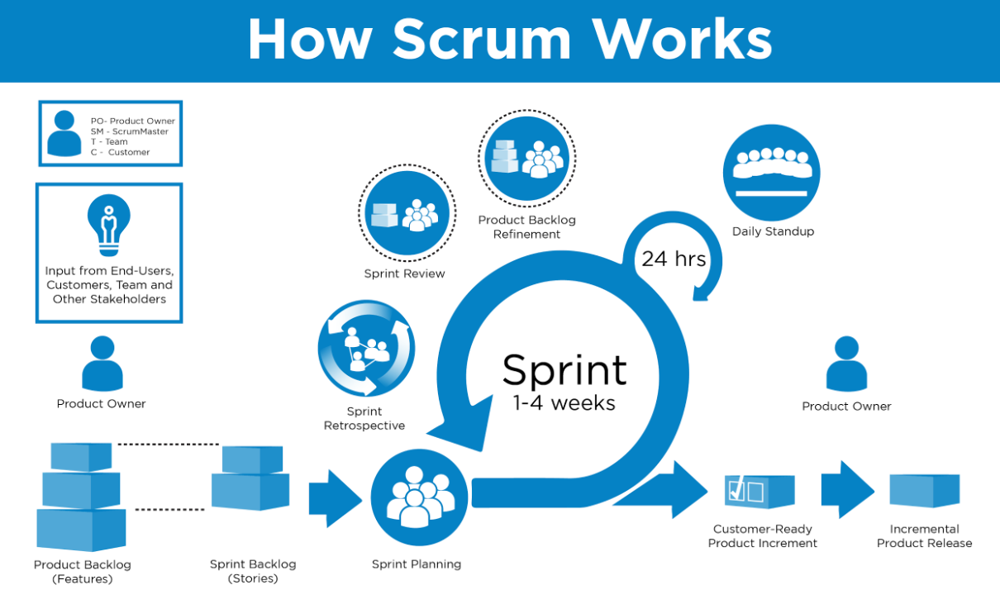

# Scrum

## Referêmcoas
<https://scrum.brod.com.br/>

<https://scrumguides.org/>

**Scrum** é uma metodologia ágil focada na entrega incremental de produtos através de ciclos curtos de desenvolvimento chamados "sprints". Aqui está um resumo dos principais elementos:

### Papéis:
1. **Product Owner**:
   - Responsável por maximizar o valor do produto.
   - Garante que o backlog do produto esteja claro, priorizado e alinhado com as necessidades do cliente.
   - Representa os interesses dos stakeholders e define o que deve ser trabalhado na sprint.

2. **Scrum Master**:
   - Atua como facilitador do time, removendo impedimentos e ajudando a equipe a entender e seguir as práticas do Scrum.
   - Focado em melhorar os processos e garantir que o time siga os princípios ágeis.
   - Protege a equipe contra interferências externas.

3. **Time de Desenvolvimento**:
   - Um grupo multifuncional responsável por entregar o incremento do produto ao final de cada sprint.
   - Autogerenciado, com habilidades variadas (desenvolvimento, testes, etc.).
   - Trabalha colaborativamente para completar o que foi acordado para a sprint.

### Artefatos:
1. **Product Backlog**:
   - Lista priorizada de tudo que deve ser desenvolvido no produto.
   - Mantida e atualizada pelo Product Owner, evoluindo conforme as necessidades mudam.

2. **Sprint Backlog**:
   - Conjunto de itens do Product Backlog selecionados para serem desenvolvidos na sprint.
   - Inclui o plano de como o time vai entregar esses itens e atingir a meta da sprint.

3. **Incremento**:
   - É o resultado tangível e potencialmente utilizável ao final de cada sprint.
   - O incremento deve atender à "Definição de Pronto" (Definition of Done), que define os critérios para que um item seja considerado completo.

### Cerimônias (ou eventos):
1. **Sprint Planning**:
   - Reunião no início da sprint para definir o que será feito (objetivo da sprint) e como o time de desenvolvimento vai trabalhar para entregar isso.
   - Dividida em duas partes: "O que fazer" e "Como fazer".

2. **Daily Scrum (ou Daily Stand-up)**:
   - Reunião diária curta (máximo 15 minutos) em que os membros do time sincronizam atividades e ajustam o plano para o próximo dia de trabalho.
   - Perguntas típicas: O que fiz ontem? O que farei hoje? Algum impedimento?

3. **Sprint Review**:
   - Reunião ao final da sprint para revisar o incremento e obter feedback dos stakeholders.
   - O time apresenta o que foi desenvolvido e discute possíveis mudanças ou melhorias no produto.

4. **Sprint Retrospective**:
   - Reunião focada em refletir sobre o processo da sprint, identificando pontos que podem ser melhorados.
   - O time busca continuamente melhorias no processo de trabalho.

5. **A Sprint**:
   - Ciclo fixo de tempo (geralmente de 1 a 4 semanas) onde o trabalho é realizado. É o "coração" do Scrum.
   - Durante a sprint, mudanças não são feitas no escopo e o time se concentra em alcançar a meta definida.

Esses elementos juntos criam um ambiente de desenvolvimento ágil, com foco na adaptação contínua, feedback rápido e entrega frequente de valor.
