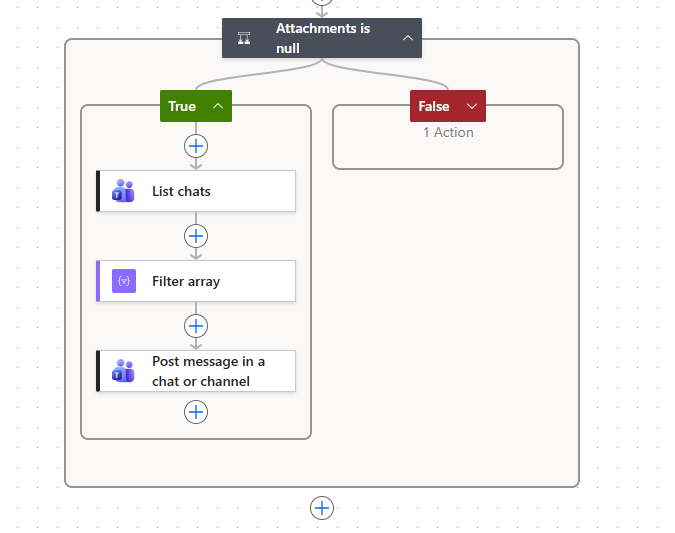
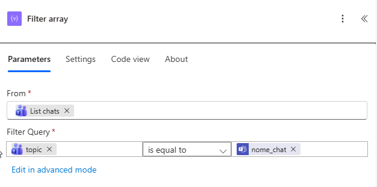

# Mandar mensagem para o Teams.

## Criando um webhook
Para criar um Webhook de Chat/Canal, \
clique nos 3[...] do Chat, \
opção Fluxos de Trabalho, \
Escolha: Enviar alertas de Webhook para um chat.\
Defina o Chat e Clique em Salvar.

## Modificando o tipo de ação
Depois acesse: <https://make.powerautomate.com/>\
No lado esquerdo, acesse "My Flows ou Fluxos".\
Clique no Fluxo e edite-o,\
Na última opção do Fluxo "Attachments is null", clique para visualizar mais (seta para baixo).

Clique em + e Informe os dados:\
Post message in a chat or channel.\
Post as: Flow bot\
Post in: Chat em Grupo\
Chat em Grupo: Escolha o Chat\
Mensagem: \
Aperte / no campo da mensagem e escolha Insert Expression: \
Coloque: `triggerBody()?['text']` e clique em Add.

Remova o Post Card in a chat or channel 1.

### Modificando para um Chat dinamico.
Chat em Grupo: Enter custom value\
Aperte / no campo da mensagem e escolha Insert Expression: \
Coloque: `triggerBody()?['channel_id']`

### Modificando para qualquer chat especificado por nome



Deve-se editar o Workflow e criar mais ações.
- List Chats
- Filter Array
- Post message in a chat or channel

#### List Chats
- Chat Types: Group
- Topic: All Chats
#### Filter Array

- From: List chats
- Filter Query:
  - Digitar / para criar expressão personalizada: `item()?['topic']`
  - is equal to
  - Digitar / para criar expressão personalizada: `triggerBody()?['nome_chat']`
#### Post message in a chat or channel
- Chat em Grupo:
  - Digitar / para criar expressão personalizada: `first(body('Filter_array'))?['id']`
    
## Como testar:

Defina o webhook em uma variável, como exemplo:
```
export TEAMS_WORKFLOW_URL=endereco_do_webhook
```
Defina uma mensagem em uma variável, como exemplo:
```
MENSAGEM="Ola a todos!"
```

Execute um Curl:
```
curl -s -w "%{http_code}" -X POST -H "Content-Type: application/json" -d "{\"text\": \"$MENSAGEM\"}" "$TEAMS_WORKFLOW_URL"
```

### Chat dinamico 

Vai precisar do ID do Chat. Este pode ser obtido da seguinte forma:\
Vá no Teams, clique nos três pontos ... ao lado do Canal e escolha Obter link para o canal.\
O link será algo como: `https://teams.microsoft.com/l/channel/19:8728c87..........491b43e1e3f7eab@thread.v2/conversations...`\
O Chat/Channel ID será: `19:8728c87..........491b43e1e3f7eab@thread.v2`

Crie uma nova variável:
```
CHANNEL_ID="19:8728c87..........491b43e1e3f7eab@thread.v2"
```

Execute um Curl:
```
curl -s -w "%{http_code}" -X POST -H "Content-Type: application/json" -d "{\"text\": \"$MENSAGEM\", \"channel_id\": \"$CHANNEL_ID\"}" "$TEAMS_WORKFLOW_URL"
```

### Chat Especificando nome

Crie uma nova variável:
```
NOME_CHAT="Chat X"
```

Execute um Curl:
```
curl -s -w "%{http_code}" -X POST -H "Content-Type: application/json" -d "{\"text\": \"$MENSAGEM\", \"nome_chat\": \"$NOME_CHAT\"}" "$TEAMS_WORKFLOW_URL"
```
