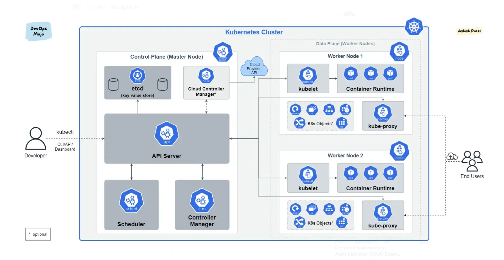

# Administração de um Cluster Kubernetes

- [Conceitos](resumo.md)
- [Instalar](install.md)
- [Manifesto](example.yaml)
- [Kube Prometheus Stack](kube-prometheus-stack/README.md)
- [Certificados do Cluster](certs.md)
- [Cotas por Namespace](cotas.md)
- [Novo Node](newnode.md)
- [Outros Usuarios](users.md)
- [Registry Privado](Registry.md)
- [Upgrade versão](upgrade.md)
- [Problemas e Erros](troubleshooting.md)
